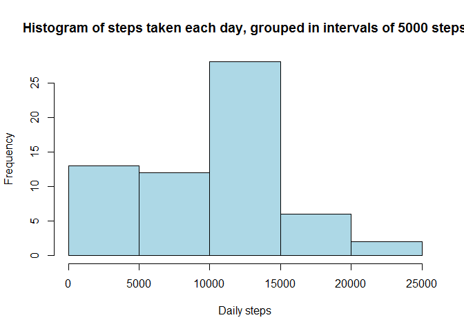

# Reproducible Research: Peer Assessment 1


## Loading and preprocessing the data
This script assumes that the data file activity.zip has been downloaded and unpacked to the working directory as a file named *activity.csv*  
  

```r
library(data.table) ## required for fread
data <-fread("activity\\activity.csv")
```
  
After checking the structure of the data, looking for missing values, data types, the content of the  etc. I concluded that:  
- Only *steps* are missing, the interval and date variables do not contain NA:s.  
- The rest of the content of the variable *steps* seems ok; It is plausible to take 806 steps in five minutes and it seems ok that more than half of the time the person is not walking at all (sleeping or sitting down).  
- The *intervals* seem to be labelled by hours and minutes starting with the initial minute the day in question, "0" stands for 00:00 "2055" for 20:55 etc.  
- Only the correct days are included in the *date* variable.  
- The missing values are always missing for an entire day when they are missing.   
  

## What is mean total number of steps taken per day?
Plotting a plain histogram that shows the amount of steps each day:    


```r
library(dplyr) ## dplyr is needed for the summarise-function
```

```
## 
## Attaching package: 'dplyr'
```

```
## The following objects are masked from 'package:data.table':
## 
##     between, last
```

```
## The following objects are masked from 'package:stats':
## 
##     filter, lag
```

```
## The following objects are masked from 'package:base':
## 
##     intersect, setdiff, setequal, union
```

```r
dailysteps <- data %>% group_by(date) %>% summarise(sum(steps, na.rm=TRUE)) 
names(dailysteps) <- c("date", "totalsteps")
```


```r
hist(dailysteps$totalsteps, breaks=61, main="Histogram of steps taken each day", xlab="Daily steps", col="lightblue")
```

<!-- -->

```r
dev.copy(png, file="figures\\RR_ass1_dailysteps.png", width = 1080, height = 480) ##saving the plot into the /figures -folder
```

```
## png 
##   3
```

```r
dev.off()
```

```
## png 
##   2
```
  
The above picture is nice but grouping the steps into intervals of 5000 steps gives a nicer picture of how many days have been days of very little, moderate and heavy excercise respectively:

```r
hist(dailysteps$totalsteps, breaks=5, main="Histogram of steps taken each day, grouped in intervals of 5000 steps", xlab="Daily steps", col="lightblue")
```

<!-- -->

```r
dev.copy(png, file="figures\\RR_ass1_dailysteps_grouped.png", width = 1080, height = 480) ##saving the plot into the /figures -folder
```

```
## png 
##   3
```

```r
dev.off()
```

```
## png 
##   2
```

The mean amount of daily steps is 9354.2295082 and the median of daily steps is 10395.


## What is the average daily activity pattern?

The daily activity pattern plotted by five minute intervals:


```r
intervalsteps <- data %>% group_by(interval) %>% summarise(mean(steps, na.rm=TRUE)) 
names(intervalsteps)<- c("interval", "totalsteps")

library(lattice)
xyplot( totalsteps ~ interval, intervalsteps, type='l', main="Average number of steps taken per interval", xlab="Interval", ylab="Steps")
```

<!-- -->

```r
dev.copy(png, file="figures\\RR_ass1_intervalsteps.png", width = 1080, height = 480) ##saving the plot into the /figures -folder
```

```
## png 
##   3
```

```r
dev.off()
```

```
## png 
##   2
```

The maximum average number of steps are present in the interval: 835.


## Imputing missing values
  
The total number of missing values in the data set is 15264.  
  
As the data for steps is always missing for an entire day I decided to impute the 
mean value of each interval into the appropriate missing values. This will not 
change the mean values calculated for the intervals and the days with missing 
values will now have values corresponding to the overall means. The code for the 
imputation:  


```r
data_new <- data

length <- length(data_new$steps)

for (i in 1:length) {
    if (is.na(data_new$steps[i])) { 
        a <- data_new$interval[i]
        data_new$steps[i] <- intervalsteps$totalsteps[intervalsteps$interval==a] 
    }
}

dailysteps_new <- data_new %>% group_by(date) %>% summarise(sum(steps, na.rm=TRUE)) 
names(dailysteps_new) <- c("date", "totalsteps")
```
  
A plain histogram that shows the amount of steps each day after the imputation:  

```r
hist(dailysteps_new$totalsteps, breaks=61, main="Histogram of steps taken each day after imputation", xlab="Daily steps", col="lightblue")
```

<!-- -->

```r
dev.copy(png, file="figures\\RR_ass1_dailysteps_new.png", width = 1080, height = 480) ##saving the plot into the /figures -folder
```

```
## png 
##   3
```

```r
dev.off()
```

```
## png 
##   2
```
  
Again, the above picture is nice but grouping the steps into intervals of 5000 steps gives a nicer picture of how many days have been days of very little, moderate and heavy excercise respectively:

```r
hist(dailysteps_new$totalsteps, breaks=5, main="Histogram of steps taken each day, grouped in intervals of 5000 steps", xlab="Daily steps", col="lightblue")
```

<!-- -->

```r
dev.copy(png, file="figures\\RR_ass1_dailysteps_grouped_new.png", width = 1080, height = 480) ##saving the plot into the /figures -folder
```

```
## png 
##   3
```

```r
dev.off()
```

```
## png 
##   2
```

Where the original mean of daily steps was 9354.2295082, 
the new mean is 1.0766189\times 10^{4}. The mean has 
increased a little.    
  
Where the original median was 10395 
the new median is 1.0766189\times 10^{4}. Here we 
can observe a small increase too.  
  
## Are there differences in activity patterns between weekdays and weekends?
  
To address the last question we load the *lubridate*-package for easier manipulation
of the dates and weekdays. (Just to be on the safe side, as my locale is not in the US, 
I decided to use the wday()-function instead of the weekday()-function that returns 
a character string, in my case with special characters.)  
  

```r
library(lubridate) 
```

```
## 
## Attaching package: 'lubridate'
```

```
## The following objects are masked from 'package:data.table':
## 
##     hour, mday, month, quarter, wday, week, yday, year
```

```r
data_new$date <- ymd(data_new$date) 
data_new$wday <- wday(data_new$date) 
data_new$wdaywkend[data_new$wday==1] <- "Weekend" 
data_new$wdaywkend[data_new$wday==2] <- "Weekday"
data_new$wdaywkend[data_new$wday==3] <- "Weekday"
data_new$wdaywkend[data_new$wday==4] <- "Weekday"
data_new$wdaywkend[data_new$wday==5] <- "Weekday"
data_new$wdaywkend[data_new$wday==6] <- "Weekday"
data_new$wdaywkend[data_new$wday==7] <- "Weekend"
```
  
Create a factor of the weekday/weekend information:  


```r
data_new$wdaywkend <- factor(data_new$wdaywkend)
```

Then we want to average the steps according to both the weekday/weekend and the intervals:  

```r
intervalsteps_new <- data_new %>% group_by(wdaywkend, interval) %>% summarise(mean(steps, na.rm=TRUE)) 
names(intervalsteps_new)<- c("wdaywkend", "interval", "meansteps")
```
  
Plot the information:

```r
library(lattice)
xyplot( meansteps ~ interval|wdaywkend, intervalsteps_new, type='l', main="Average number of steps taken per interval, weekday vs. weekend", xlab="Interval", ylab="Steps")
```

<!-- -->

```r
dev.copy(png, file="figures\\RR_ass1_intervalsteps_wdaywkend.png", width = 1080, height = 480) ##saving the plot into the /figures -folder
```

```
## png 
##   3
```

```r
dev.off()
```

```
## png 
##   2
```
  
Conclusion: The activities are more evenly spread over the weekends whereas the weekday plot shows a peak in the morning, approximately at around 9 AM.
